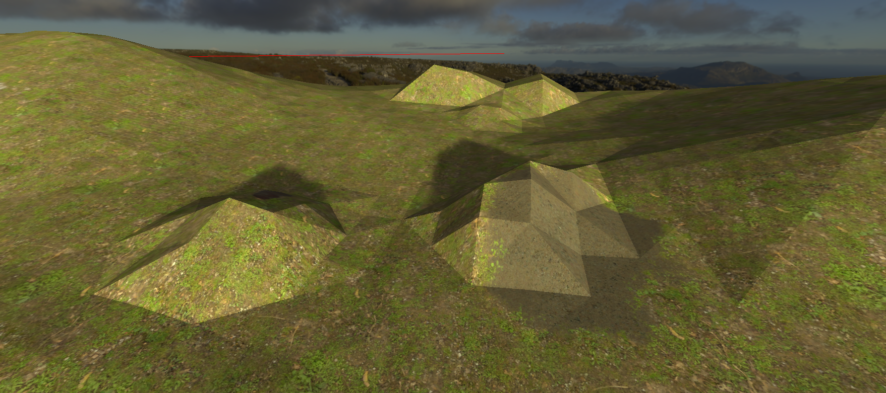

# Godot-Low-Poly
Provides a simple low-poly shader for zylann's terrain plugin

**How it works:**
This shader modifies the standard shader's normal generation, meaning the normals will make the face look like low poly.
This is excellent if you want a low poly terrain

**Requirements:**
This shader works with zylann's terrain plugin:
https://github.com/Zylann/godot_heightmap_plugin

**How to use:**
This assumes you have the terrain plugin installed and active.

First, download the low_poly.shader file and add it to your project.
To use it, add a terrain node, set shader type to custom and select low_poly.shader under custom shader (after adding it to your project).

**Notes:**
This project has only been tested on windows with OpenGL ES 3.
Since it makes use of the dFdx and dFdy functions, it does not function in openGL ES 2
